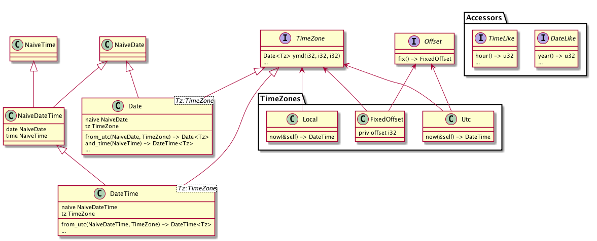

# API Notes

## Current Trait/Type organization

(this uses "C" for structs and "I" for traits)

A few things to note:

* There is no such thing as `Time`, only `NaiveTime`
* `Date<Tz>` doesn't actually make sense.
* TimeZone has an associated `Offset` type which is always a `TimeZone` which
  implements Offset and except for `Local` is always the same type as the trait
  is implemented for. (That is `Utc::Offset` is `Utc`, `FixedOffset::Offset` is
  `FixedOffset`, but `Local::Offset` is `FixedOffset`).
* Almost all of the constructors for `DateTime` are on `TimeZone`, although
  you can get to a `DateTime` by way of `NaiveDateTime::...::with_timezone`,
  which is a really ugly API, but one that people keep re-inventing.

## Warts

* Construction of DTs is confusing
* Large number of types/traits that are not necessarily named after what they
  do (mostly just that constructors are in `TimeZone`)
* `Local` is kind of just another `FixedOffset`
  * Except that `FixedOffset` doesn't have a way to load the current time, just
    `Utc.now()` and `Local.now()`. I'd rather get rid of `Local` in favor of
    `FixedOffset::local_offset()` or something less ugly
    (`chrono::now_local()` vs `chrono::now_utc()`?)
* Bad error messages for parsing/unparsing
* No types for time units (`enum Month`, etc `YearMonth` is obvious), this is
  necessary for nice iteration (current implementation in PR from gnzlbg) and
  maybe constructors
* Obvious methods panic internally, must use `*_opt()` methods to get
  `Options` (not results)

definitely more

## Known Unknowns

* At least *think* about converting to other calendar systems
* No-std support
* Iterators a PR exists, but I would like to make sure that all our iterators
  have an intuitive API.
